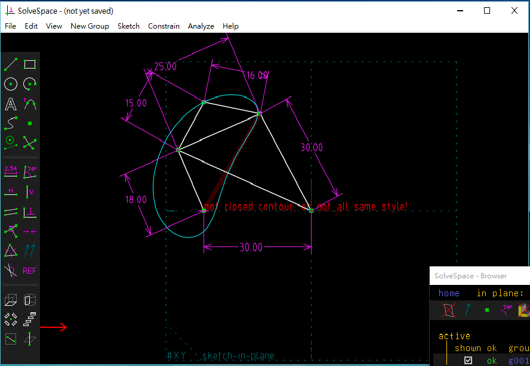
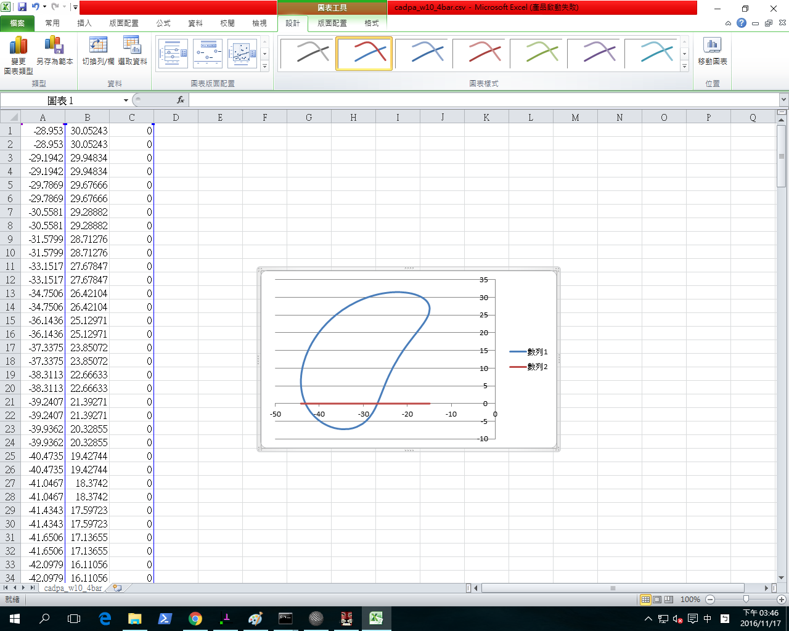

Title: 40423119 11/17 fourbar
Date: 2016-10-27 11:00
Category: HomeWork
Tags: 作業
Author: 40423119

<!-- PELICAN_END_SUMMARY -->

直接利用 Solvespace Analyze-Trace Point-Stop Trace 得到下列繞行路徑:

將所得到的點座標 .csv 以 Excel 畫圖, 得到:

